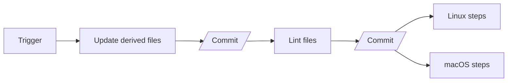

# PoC Github Actions

We want to update the CI setup of [everest][] to accommodate for CI authored commit back into the PRs.

## Scenarios

### Current

1. A contributor or automated system opens a PR that may or may not change package manager files
1. CI runs on the PR
   1. CI fails if package manager derived files need updating
   1. CI fails if linters require files changes
1. a human intervention is required to correct the PR and commit on top

### Expected

1. A contributor or automated system opens a PR that may or may not change package manager files
1. CI runs on the PR
    1. if package manager derived files need updating, CI commits back those changes to the PR
    1. if linters require files changes, CI commits back those changes to the PR
    1. CI continues and fail/pass based on updated code

In this scenario, unless there are breaking changes in the updated dependencies, no human intervention is required.

## What does done mean

If a PR bumping the integer in //:deps.txt triggers a commit from CI into the PR that bump the int in //:third_party/deps-derived.txt and keep the tests passing, we are done.

## Notes

### Commit back

We are essentially trying to emulate Renovate [postUpgradeTasks][] to change the code in a PR based on project defined processes. In the case of [everest][] this is mostly about updating package manager derived files.

We are going to use GH Action's ability to commit back to a PR with one of the following actions, or a custom one if need be:

- https://github.com/marketplace/actions/add-commit
- https://github.com/marketplace/actions/git-auto-commit

### Build matrix

Committing back to the PR in CI means we need to **do this before** the steps that use the [jobs matrix][] and split the execution across runners (Linux and macOS at the moment). This is also true for the linting commits.

In summary, we probably want 2 potentials commits by the CI, and then the matrix:

[everest]: https://github.com/satreix/everest
[jobs matrix]: https://docs.github.com/en/actions/using-jobs/using-a-matrix-for-your-jobs
[postUpgradeTasks]: https://docs.renovatebot.com/configuration-options/#postupgradetasks
